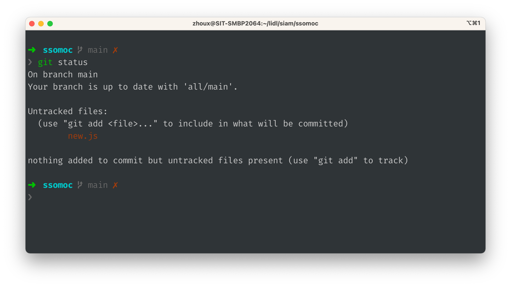

# My-zsh

<div align="center">
  
  <h3>My zsh shell config</h3>
  <p>Personal favorite shell and private config for awesome looking</p>

  <p>
    <a href="#">
      
    </a>
    <a href="#">
      
    </a>
  </p>
</div>

---

## Install 
install `zsh`, see <https://github.com/ohmyzsh/ohmyzsh/wiki/Installing-ZSH>
```bash
brew install zsh
chsh -s /usr/local/bin/zsh
## or macOS High Sierra and older:
chsh -s /bin/zsh
```

install `oh-my-zsh`, see <https://ohmyz.sh/#install>
```bash
sh -c "$(curl -fsSL https://raw.github.com/ohmyzsh/ohmyzsh/master/tools/install.sh)"
```
check the state of `oh-my-zsh`
```bash
omz plugin list
omz theme list
```


## Minimal & Awesome looking




## licence

[MIT](./LICENSE) License © 2021 [@vikbert](https://vikbert.github.io/)